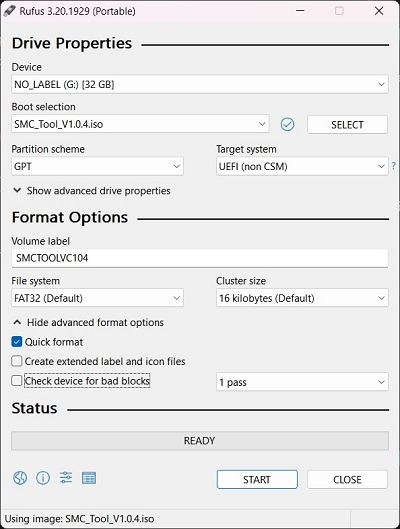
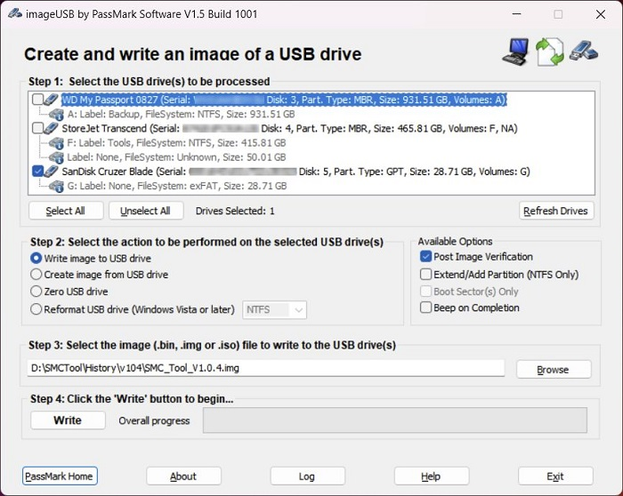

**Bootable USB creation:**
-

**Requirements:**

- A memory stick, 64 megabytes minimum, formatted in ExFAT, FAT32, VFAT or HFS+.\
`Using a GUID Partition Table (GPT) is recommended`
- A copy of SMC Tool in the applicable format.
- Half a brain cell.
---
**Windows:**
-
**Manual Creation:**

1. Mount [SMC_Tool.iso](https://github.com/MuertoGB/SMCTool/releases) and copy it's contents to your formatted memory stick.
2. Done, yes... that easy. Why I continued writing I cannot answer.
---
**Using Rufus:**
1. Acquire a copy of Rufus from [here](https://github.com/pbatard/rufus/releases).
2. Open Rufus and select your memory stick from the device dropdown list.
3. Click the `SELECT` button and choose [SMC_Tool.iso](https://github.com/MuertoGB/SMCTool/releases) as the media.
4. Choose partition scheme 'GPT' and target system 'UEFI'.
5. Under 'Format Options', select 'Show advanced format options' and deselect 'Create extended label and icon files'.
6. Click the `START` button, Rufus will then do the rest for you.

---
**Write the image directly:**
1. Acquire a copy of [imageUSB by PassMark](https://www.softpedia.com/get/System/File-Management/ImageUSB.shtml).
2. Open imageUSB and select your memory stick from the tree list.
3. Ensure the 'Write image to USB drive' radio button is checked.
4. Click the `Browse` button and choose [SMC_Tool.img](https://github.com/MuertoGB/SMCTool/releases) as the media.
5. Click the 'Write' button, imageUSB will then do the rest for you.

------------------------------------------------------------------------------------------------------------------------

MacOS an Linux instructions coming soon.

